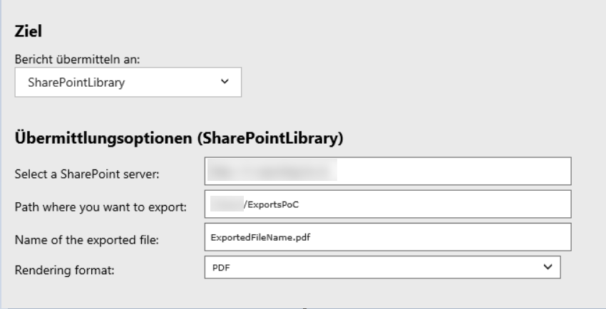

SSRS delivery extension for SharePoint
======================================

## Content:

<ul>
    <li><a href="#purpose">Purpose</a></li>
    <li><a href="#prerequisites">Prerequisites</a></li>
    <li><a href="#build">Build</a></li>
    <li><a href="#deployment">Deployment</a></li>
</ul>

<a name="purpose">PURPOSE</a>
-------

The goal is to provide a [SSRS delivery extension](https://docs.microsoft.com/en-us/sql/reporting-services/extensions/delivery-extension/delivery-extensions-overview?view=sql-server-2017) that targets SharePoint library/folder.

The goal is to provide a possibility to save a result of a subscription to a specified SharePoint server, in specified library, in a specified folder in that library:

We used UNC path for export to SharePoint in the past, but we did not find it very reliable, that's why we created this extension.

<a name="prerequisites">PREREQUISITES</a>
-------------

### .NET Framework 3.5
You need .NET Framework 3.5 if you want to build the project. Get it here:
<https://dotnet.microsoft.com/download/visual-studio-sdks?utm_source=getdotnetsdk&utm_medium=referral>

SSRS unfortunately do not support assemblies built with newer versions of .NET framework, so having .NET Framework 3.5 installed is a must.

### Visual Studio
Visual Studio is not required, but it is recommended for building the project. You can use .NET SDK or any 3rd party tool to build the project.

### Permissions
You will need administrator permissions for the SSRS or PBIRS instance where you want to install the extension.

<a name="build">BUILD</a>
-----

Open the project using Visual Studio. 
 
 Add references to these libraries:

 * Microsoft.ReportingServices.Interfaces
 * Microsoft.SharePoint.Client
 * Microsoft.SharePoint.Client.Runtime

 The first one (Microsoft.ReportingServices.Interfaces) you can get from the bin folder of your SSRS installation, wich is by default here:

 *C:\Program Files\Microsoft SQL Server\MSRS13.MSSQLSERVER\Reporting Services\ReportServer\bin*

 The other two libraries you can get after installing SharePoint client from this link:

 https://www.microsoft.com/en-us/download/details.aspx?id=21786

 After the installation, the DLLs can be found here:

 *C:\Program Files\Common Files\microsoft shared\SharePoint Client* 

Add all three files as a reference to the project and build it.

<a name="deployment">DEPLOYMENT</a>
----------

### Deploy libraries

Go to the bin directory of your built solution. Copy all the files to the bin directory of your SSRS / PBIRS server, e.g. 

*C:\Program Files\Common Files\microsoft shared\SharePoint Client*

### Edit rsreportserver configuation file

Open *rsreportserver.config* file. Find Extensions / Delivery node and add this configuration:

    <Extension Name="JC SharePoint Delivery" Type="JC.SSRS.Extensions.SharePointDelivery.SharePointDeliveryExtension,JCSharePointDeliveryExtension" Visible="true">
		<Configuration>
		</Configuration>
	</Extension>

Find Extensions / DeliveryUI node and add this configuration:

    <Extension Name="JC SharePoint Delivery" Type="JC.SSRS.Extensions.SharePointDelivery.SharePointDeliveryExtensionUI,JCSharePointDeliveryExtension">
		<DefaultDeliveryExtension>True</DefaultDeliveryExtension>
	</Extension>

### Edit rssrvpolicy configuration file

Open *rssrvpolicy.config* configuration file and add this CodeGroup as the last one in the file:

    <CodeGroup class="UnionCodeGroup" version="1" PermissionSetName="FullTrust" Name="JCDeliveryExtension" Description="SharePoint integration">
        <IMembershipCondition class="UrlMembershipCondition" version="1" Url="D:\SSRS\MSRS13.TDREAM1\Reporting Services\ReportServer\bin\JCSharePointDeliveryExtension.dll" />
    </CodeGroup>

### Restart the report server

You do not need to restart the operating system, restarting the SSRS or PBIRS service (via PowerShell or GUI) is sufficient.

After the restart, the delivery extension should be visible from the GUI and you can use it for your subscriptions.